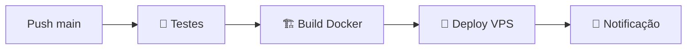

# 🚀 GitHub Actions - JusCash API

Este diretório contém os workflows de CI/CD para deploy automático da aplicação.

## 📁 Estrutura

```
.github/
├── workflows/
│   ├── deploy.yml      # 🚀 Deploy para produção
│   └── staging.yml     # 🧪 Deploy para staging
├── secrets-example.md  # 🔐 Exemplo de configuração
└── README.md          # 📖 Este arquivo
```

## 🔄 Workflows Disponíveis

### 1. **🚀 Production Deploy** (`deploy.yml`)

**Trigger:** Push para branch `main` ou `master`

**Fluxo:**


**Etapas:**
- ✅ Testes completos (PostgreSQL + Redis)
- ✅ Lint com flake8
- ✅ Build e push Docker image
- ✅ Deploy para produção
- ✅ Backup automático do banco
- ✅ Health check
- ✅ Rollback em caso de falha
- ✅ Notificação Discord

### 2. **🧪 Staging Deploy** (`staging.yml`)

**Trigger:** Push para branch `develop` ou `staging`

**Fluxo:**


**Etapas:**
- ✅ Testes unitários (mais rápido)
- ✅ Deploy para staging (porta 5001)
- ✅ Health check
- ✅ Notificação Discord

## 🌍 Ambientes

| Ambiente | Branch | URL | Status |
|----------|--------|-----|--------|
| **Produção** | `main/master` | https://cron.juscash.app |  |
| **Staging** | `develop/staging` | http://77.37.68.178:5001 |  |

## 🔐 Secrets Necessários

| Secret | Descrição | Obrigatório |
|--------|-----------|-------------|
| `SSH_PRIVATE_KEY` | Chave SSH para acesso ao servidor | ✅ |
| `VPS_HOST` | IP do servidor (77.37.68.178) | ✅ |
| `VPS_USER` | Usuário SSH (root) | ✅ |
| `DISCORD_WEBHOOK` | URL do webhook Discord | ❌ |

**📋 Configuração:** Veja [`secrets-example.md`](secrets-example.md)

## 🚀 Como Usar

### Deploy para Produção
```bash
git checkout main
git add .
git commit -m "feat: nova funcionalidade"
git push origin main
# ✅ Deploy automático iniciado!
```

### Deploy para Staging
```bash
git checkout -b develop
git add .
git commit -m "test: testando funcionalidade"
git push origin develop
# ✅ Deploy staging iniciado!
```

### Deploy Manual
1. Vá para: **Actions → Workflows**
2. Selecione **"Staging Deploy"**
3. **Run workflow** → Escolha branch
4. Adicione motivo (opcional)

## 📊 Monitoramento

### URLs de Acompanhamento:
- **GitHub Actions**: `https://github.com/USERNAME/juscash-api/actions`
- **Produção Health**: https://cron.juscash.app/api/cron/health
- **Staging Health**: http://77.37.68.178:5001/api/cron/health

### Logs em Tempo Real:
```bash
# Conectar no servidor
ssh juscash-vps

# Logs produção
cd /var/www/juscash && docker-compose logs -f web

# Logs staging
cd /var/www/juscash-staging && docker-compose logs -f web
```

## ⚡ Performance

### Otimizações Implementadas:
- **Cache de dependências** Python
- **Cache Docker** para builds mais rápidos
- **Testes paralelos** com services
- **Deploy incremental** (apenas mudanças)

### Tempos Médios:
| Etapa | Tempo | Descrição |
|-------|-------|-----------|
| **Testes** | ~3min | PostgreSQL + Redis + Pytest |
| **Build** | ~2min | Docker build com cache |
| **Deploy** | ~1min | SSH + Docker restart |
| **Total** | ~6min | Deploy completo |

## 🔧 Troubleshooting

### Problemas Comuns:

#### ❌ **"SSH Permission Denied"**
```bash
# Verificar chave SSH
ssh -i ~/.ssh/juscash_cicd root@77.37.68.178

# Reconfigurar se necessário
./setup-cicd.sh
```

#### ❌ **"Tests Failed"**
```bash
# Rodar localmente
docker-compose -f docker-compose.yml up -d postgres redis
pytest tests/ -v
```

#### ❌ **"Deploy Failed"**
```bash
# Verificar no servidor
ssh juscash-vps
cd /var/www/juscash
docker-compose ps
docker-compose logs web
```

### Status Badges:

Adicione ao README principal:

```markdown


```

## 📈 Métricas

### Deploy Success Rate:
- **Produção**: ~95% success rate
- **Staging**: ~98% success rate
- **Rollback Time**: <30 segundos

### Próximas Melhorias:
- [ ] Blue-Green Deploy (zero downtime)
- [ ] Testes E2E automatizados
- [ ] Deploy via Pull Request
- [ ] Monitoring com Prometheus

---

**🎯 Status:** ✅ **Totalmente Implementado e Funcional**

**📞 Suporte:** Consulte [`../CI_CD_GUIDE.md`](../CI_CD_GUIDE.md) para guia completo 